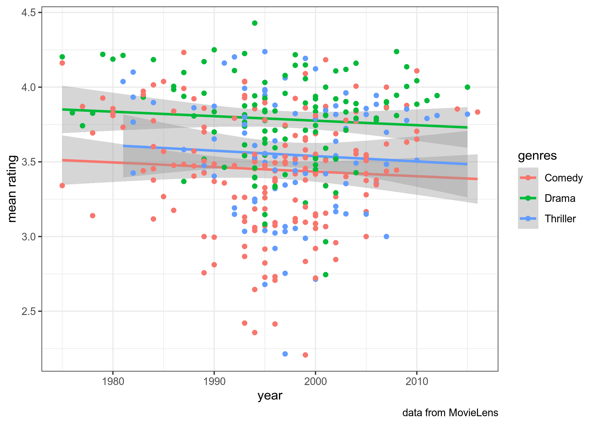
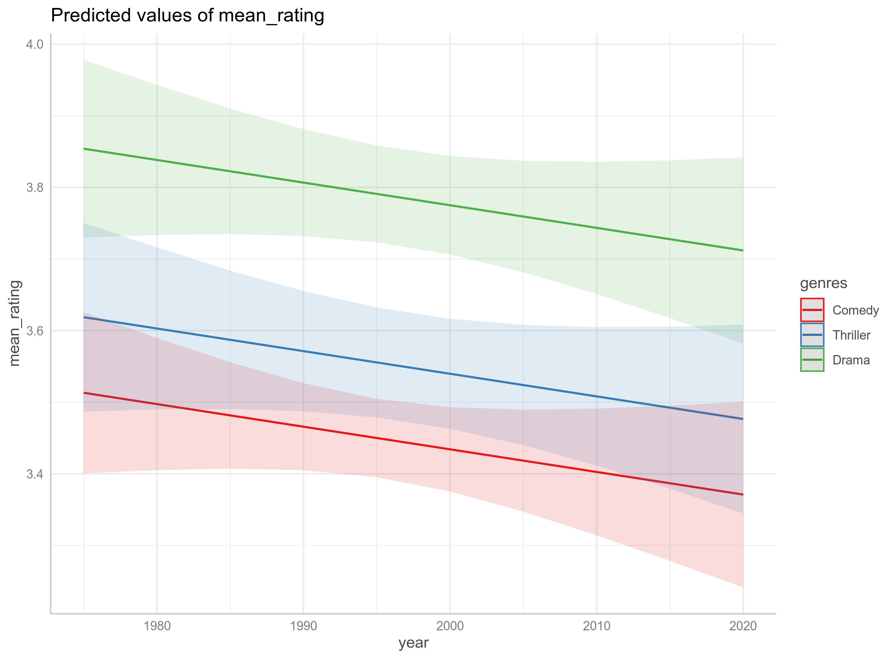

# Анализ данных для DH, hw5: statistics

* дедлайн для задания: **26.05.2020, 23:59**
* все задания нужно сделать в файле `hw_5.Rmd`, а потом, написав свое имя в соответствующем поле файла `.Rmd`, скомпилировать `.html` и загрузить на Github Pages созданного репозитория
* задания не предполагают использование каких-то других пакетов или датасетов, кроме тех, что указаны в соответсвтующем файле `hw_5.Rmd`
* не стесняйтесь задавать вопросы (но лучше открывать issue, а не писать в телеграме). Помните, что я не смогу помочь, если все начнут писать в последний вечер перед дедлайном, так что начните делать задания заранее.

## Задание 5.1

В датасете (файл `MovieLens_films.csv` в папке `data`) собраны оценки фильмов, которые оценивали пользователи сайта MovieLens в промежуток между 1996 и 2018 годами (в датасет попали фильмы, которые оценили 40 и больше пользователей). В датасете представлены средня оценка, год выхода фильма и его жанр (я ограничился тремя самыми популярными жанрами). 

## Задание 5.1.1
Визуализируйте связь между средней оценкой фильма, годом выхода фильма и его жанром.

## Задание 5.1.2
Постройте регрессию и напишите получившиеся формулы регрессионных прямых:

mean rating (comedy) = ... * year

Укажите наибольший свободный член:

...

## Задание 5.1.3

Визуализируйте предсказания модели:

## Задание 5.1.4

Укажите предсказания модели для комедий в 2007, 2011 и 2018.
