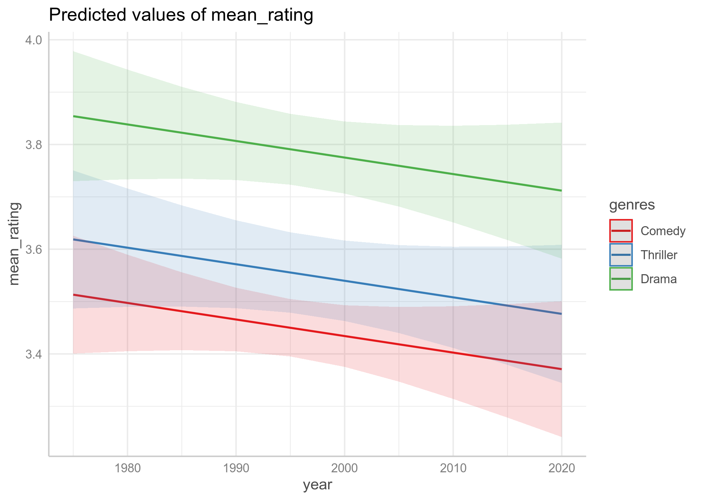
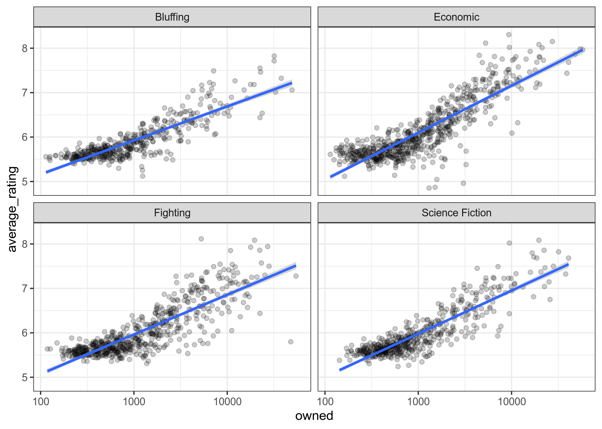
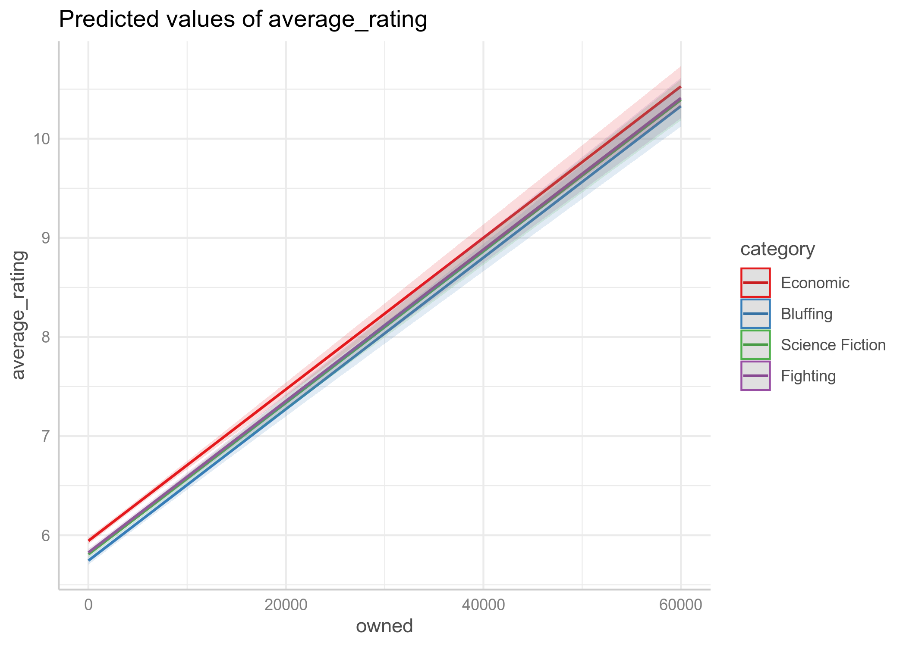
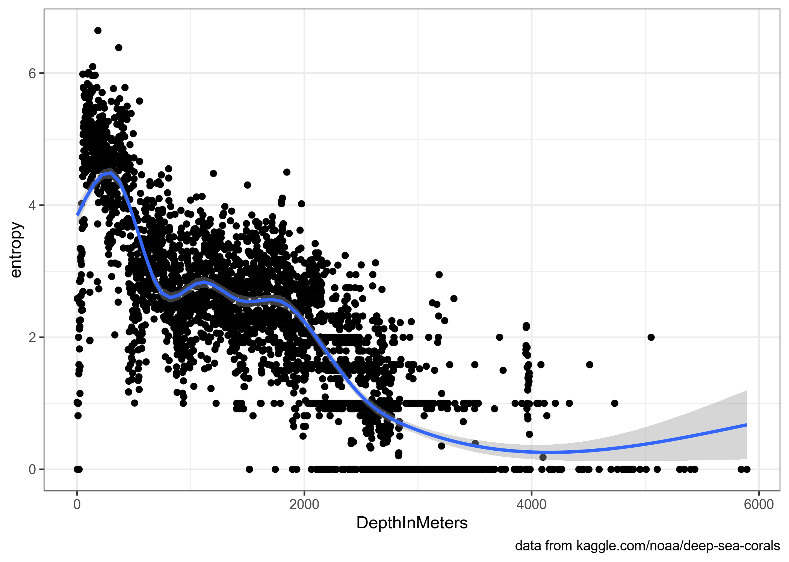

# Анализ данных для DH, hw5: statistics

* дедлайн для задания: **02.06.2020, 23:59**
* все задания нужно сделать в файле `hw_5.Rmd`, а потом, написав свое имя в соответствующем поле файла `.Rmd`, скомпилировать `.html` и загрузить на Github Pages созданного репозитория
* задания не предполагают использование каких-то других пакетов или датасетов, кроме тех, что указаны в соответсвтующем файле `hw_5.Rmd`
* не стесняйтесь задавать вопросы (но лучше открывать issue, а не писать в телеграме). Помните, что я не смогу помочь, если все начнут писать в последний вечер перед дедлайном, так что начните делать задания заранее.

## Задание 5.1

В датасете (файл `MovieLens_films.csv` в папке `data`) собраны оценки фильмов, которые оценивали пользователи сайта MovieLens в промежуток между 1996 и 2018 годами (в датасет попали фильмы, которые оценили 40 и больше пользователей). В датасете представлены средня оценка, год выхода фильма и его жанр (я ограничился тремя самыми популярными жанрами). 

## Задание 5.1.1
Визуализируйте связь между средней оценкой фильма, годом выхода фильма и его жанром.

## Задание 5.1.2
Постройте регрессию, предсказывающую средний рейтинг фильм в зависимости от года выхода фильма и его жанра, и напишите получившиеся формулы регрессионных прямых (с точностью до 4 знаков после запятой):

mean rating (comedy) = ... * year

Укажите наибольший свободный член:

...

## Задание 5.1.3

Визуализируйте предсказания модели:

## Задание 5.1.4

Укажите предсказания модели для комедий в 2007, 2011 и 2018.

## Задание 5.2
В датасет (файл `board_games.csv` в папке `data`) собраны подгруппа настольных игр с сайта boardgamegeek.com со следующими переменными:

* `id` --- идентификационный номер игры
* `name` --- название игры
* `min_players` --- минимальное количество игроков
* `max_players` --- максимальное количество игроков
* `play_time` --- время игры
* `min_age` --- минимальный возраст
* `published` --- год издания
* `owned` --- количество обладателей игры
* `average_rating` --- средний рейтинг игры
* `category` --- категория игры

## Задание 5.2.1
Визуализируйте связь между перемеными `owned`, `average_rating` и `category` (я использовал аргумент `alpha = 0.2`).

## Задание 5.2.2
Постройте регрессию, предсказывающую средний рейтинг игры в зависимости от количество обладателей игры и ее типа, и напишите получившиеся формулы регрессионных прямых (с точностью до 4 знаков после запятой):

average rating (bluffing) = ... * owned

Укажите наибольший свободный член:

...

## Задание 5.2.3

Визуализируйте предсказания модели:

## Задание 5.2.4

Укажите какой рейтинг предсказывает модель для экономических игр, которыми владеют 3000 и 5000 человек.

## Задание 5.3

В датасет (файл `deep_sea_corals.csv` в папке `data`) собрана информация о разных видах кораллов обнаруженных исследователеми в океане (модифицированный варианта [этого датасета](https://www.kaggle.com/noaa/deep-sea-corals)) со следующими переменными:

* `ScientificName` --- название коралла
* `longitude` --- широта, где коралл был обнаружен
* `latitude` --- долгота, где коралл был обнаружен
* `DepthInMeters` --- глубина, на которой был обнаружен коралл
* `DataProvider`  --- источник информации
* `SamplingEquipment` --- метод, которым была собрана информация

Посчитайте и визуализируйте разнообразие кораллов (энтропию) в зависимости от глубины (каждая точка уникальная глубина):

## Задание 5.4
В одной статье (выдуманной), в которой использовались данные из обсуждаемого датасета (файл `deep_sea_corals.csv` в папке `data`), приводится следующее утверждение:

> Мы исследовали два наиболее распространненых вида кораллов (Heteropolypus ritteri и Lophelia pertusa) и обнаружили, что существует некоторый барьер обитания в 1000 метров ниже уровне моря для обитания вида Lophelia pertusa. Мы обнаружили, что ниже уровня 1000 метров вид Heteropolypus ritteri обитает значительно чаще чем Lophelia pertusa (χ2(1) = 36, p < 2.2e-16).

## Задание 5.4.1

Используйте пакет `statcheck` для проверки результатов статистического теста. Опишите, какие проблемы Вы нашли.

## Задание 5.4.2

Проведите тест хи-квадрат самостоятельно. Какие значения статистического теста Вы получили? Что бы Вы написали в ревью на статью?

## Задание 5.4.3

Приведите ожидаемое значение, использованное в тесте хи-квадрат с точностью до 1 знака после запятой.